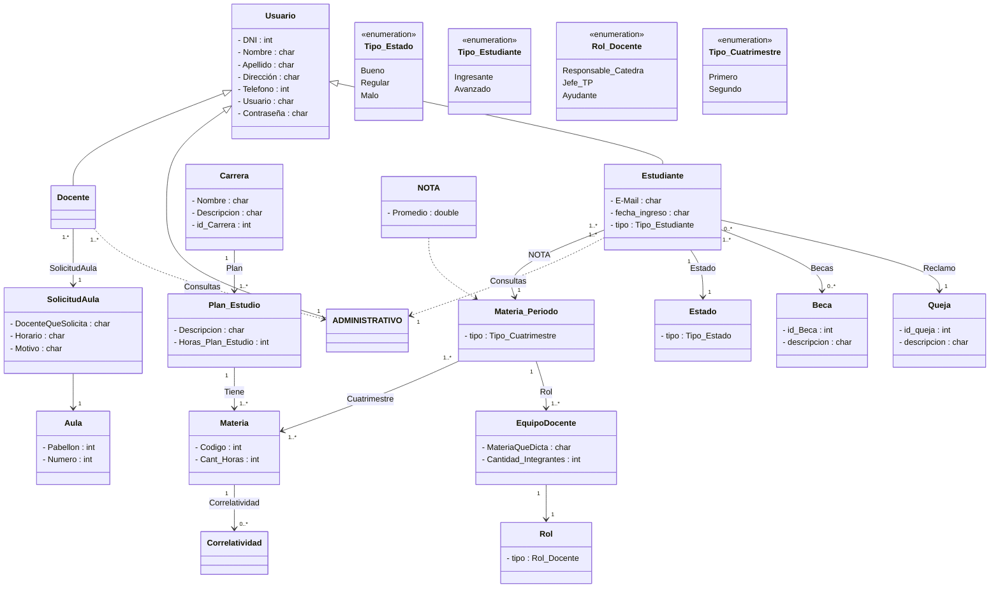
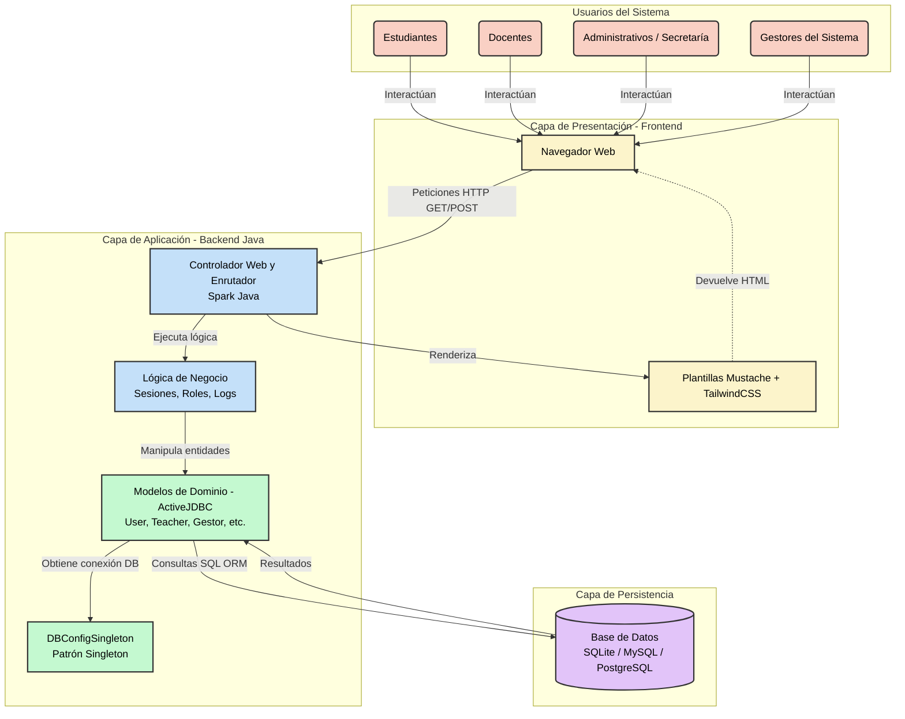
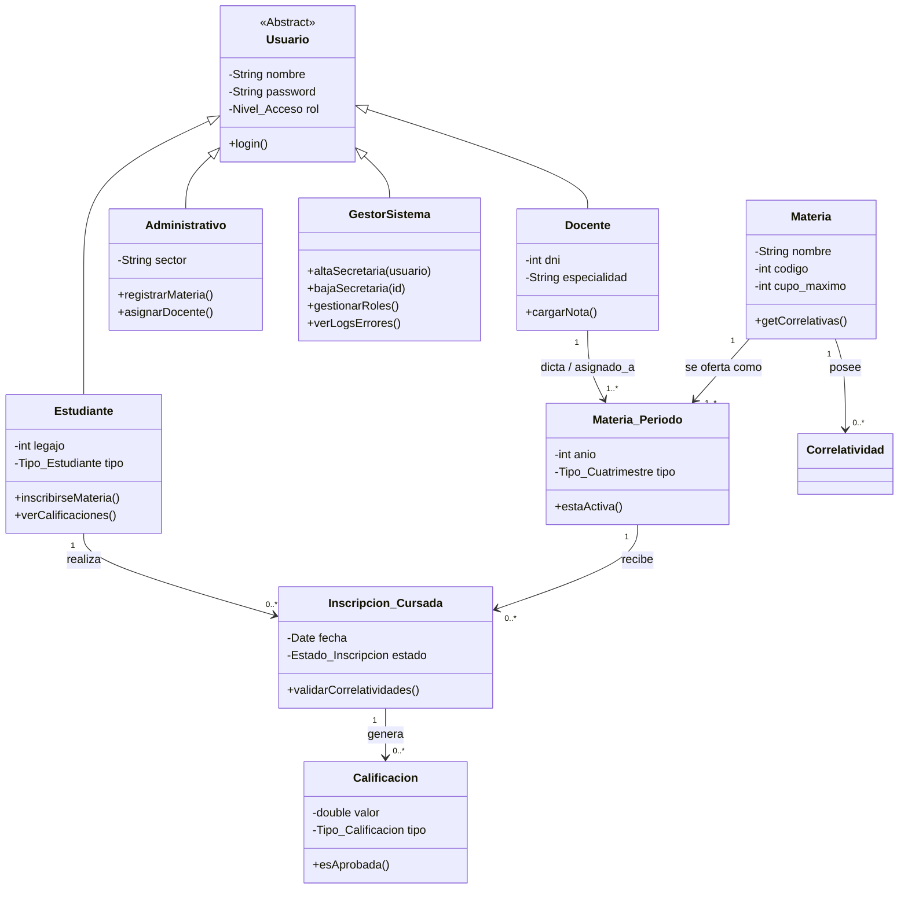

# Diagrama Original

Diagrama del proyecto creado durante Ingeniería de Software I.

# Diagrama Nuevas Funcionalidades

```mermaid
classDiagram

  

%% ─── ENUMERACIONES ───────────────────────────────────────────

class Tipo_Estado {

<<enumeration>>

Bueno

Regular

Malo

}

  

class Tipo_Estudiante {

<<enumeration>>

Ingresante

Avanzado

}

  

class Rol_Docente {

<<enumeration>>

Responsable_Catedra

Jefe_TP

Ayudante

}

  

class Tipo_Cuatrimestre {

<<enumeration>>

Primero

Segundo

}

  

class Tipo_Calificacion {

<<enumeration>>

Parcial

Recuperatorio

Final

}

  

class Estado_Inscripcion {

<<enumeration>>

Pendiente

Aprobada

Rechazada

}

  

class Estado_Aula {

<<enumeration>>

Disponible

Ocupada

Reservada

}

  

class Tipo_Aviso {

<<enumeration>>

Informativo

Urgente

Academico

}

  

class Nivel_Acceso {

<<enumeration>>

Alumno

Docente

Secretaria

Administrador

}

  

%% ─── USUARIOS ────────────────────────────────────────────────

class Usuario {

- DNI : int

- Nombre : char

- Apellido : char

- Direccion : char

- Telefono : int

- nombreUsuario : char

- contrasena : char

- nivelAcceso : Nivel_Acceso

- activo : boolean

+ login(usuario, contrasena) boolean

+ logout() void

+ cambiarContrasena(nueva) void

+ validarCredenciales() boolean

}

  

class Sesion {

- id_sesion : int

- fechaInicio : datetime

- fechaExpiracion : datetime

- tokenAcceso : char

- activa : boolean

+ iniciar(usuario) void

+ cerrar() void

+ verificarExpiracion() boolean

+ renovar() void

}

  

class Estudiante {

- E_Mail : char

- fecha_ingreso : char

- tipo : Tipo_Estudiante

- legajo : int

+ inscribirseMateria(materia) boolean

+ inscribirseExamen(examen) boolean

+ verCalificaciones() List~Calificacion~

+ verPlanEstudio() Plan_Estudio

+ verificarCorrelatividades(materia) boolean

+ consultarEstado() Estado

}

  

class Docente {

- legajoDocente : int

- email : char

- especialidad : char

+ cargarNota(inscripcion, valor, tipo) void

+ crearAviso(titulo, contenido, tipo) Aviso

+ reservarAula(solicitud) SolicitudAula

+ editarNota(calificacion, nuevoValor) void

+ verMateriasAsignadas() List~Materia~

}

  

class SecretariaAcademica {

- email : char

- sector : char

+ registrarCarrera(carrera) void

+ modificarCarrera(carrera) void

+ darBajaCarrera(id) void

+ registrarMateria(materia) void

+ asignarDocente(docente, materia) void

+ gestionarInscripcion(inscripcion) void

+ responderConsulta(consulta) void

}

  

class GestorSistema {

- email : char

+ altaSecretaria(usuario) void

+ bajaSecretaria(id) void

+ gestionarRoles() void

}

  

class Estado {

- tipo : Tipo_Estado

+ evaluarEstado(promedio) Tipo_Estado

}

  

%% ─── ACADÉMICO ───────────────────────────────────────────────

class Carrera {

- id_Carrera : int

- Nombre : char

- Descripcion : char

- duracionAnios : int

- codigo : char

+ agregarPlan(plan) void

+ getPlanVigente() Plan_Estudio

}

  

class Plan_Estudio {

- id_Plan : int

- Descripcion : char

- Horas_Plan_Estudio : int

- anioVigencia : int

+ getMaterias() List~Materia~

+ calcularHorasTotales() int

}

  

class Materia {

- Codigo : int

- Nombre : char

- Cant_Horas : int

- cupo_maximo : int

- regimen : char

+ getCorrelativas() List~Materia~

+ getCupoDisponible() int

+ agregarCorrelativa(materia) void

}

  

class Correlatividad {

- id_correlativa : int

- obligatoria : boolean

+ validar(historialAlumno) boolean

}

  

class Materia_Periodo {

- id_periodo : int

- tipo : Tipo_Cuatrimestre

- anio : int

- cuposOcupados : int

+ getCuposDisponibles() int

+ estaActiva() boolean

+ agregarInscripcion(inscripcion) void

}

  

%% ─── INSCRIPCIONES ───────────────────────────────────────────

class Inscripcion_Cursada {

- id_inscripcion : int

- fechaInscripcion : datetime

- estado : Estado_Inscripcion

+ validarCorrelatividades() boolean

+ validarCupo() boolean

+ confirmar() void

+ cancelar() void

}

  

class Inscripcion_Examen {

- id_inscripcion : int

- fechaInscripcion : datetime

- estado : Estado_Inscripcion

+ validarRegularidad() boolean

+ confirmar() void

+ cancelar() void

}

  

class Examen {

- id_examen : int

- fecha : datetime

- aula : char

- cupoMaximo : int

+ getInscriptos() List~Estudiante~

+ getCupoDisponible() int

}

  

class Acta_Examen {

- id_acta : int

- fecha : datetime

- cerrada : boolean

+ cerrarActa() void

+ agregarCalificacion(calif) void

+ getCalificaciones() List~Calificacion~

}

  

%% ─── CALIFICACIONES ──────────────────────────────────────────

class Calificacion {

- id_calificacion : int

- valor : double

- fecha : datetime

- tipo : Tipo_Calificacion

+ esAprobada() boolean

+ getValor() double

}

  

class NOTA {

- Promedio : double

+ calcularPromedio() double

+ determinarEstado() Tipo_Estado

}

  

%% ─── EQUIPOS Y ROLES ─────────────────────────────────────────

class EquipoDocente {

- MateriaQueDicta : char

- Cantidad_Integrantes : int

+ agregarDocente(docente, rol) void

+ removerDocente(docente) void

+ getIntegrantes() List~Docente~

}

  

class Rol {

- tipo : Rol_Docente

+ getPermisos() List~char~

}

  

%% ─── AULAS Y SOLICITUDES ─────────────────────────────────────

class Aula {

- Pabellon : int

- Numero : int

- capacidad : int

- estado : Estado_Aula

+ estaDisponible(horario) boolean

+ reservar(solicitud) void

+ liberar() void

}

  

class SolicitudAula {

- id_solicitud : int

- DocenteQueSolicita : char

- Horario : char

- Motivo : char

- fechaSolicitud : datetime

- aprobada : boolean

+ aprobar() void

+ rechazar() void

}

  

%% ─── COMUNICACIÓN ────────────────────────────────────────────

class Aviso {

- id_aviso : int

- titulo : char

- contenido : char

- fechaPublicacion : datetime

- tipo : Tipo_Aviso

- visible : boolean

+ publicar() void

+ archivar() void

}

  

class Consulta {

- id_consulta : int

- descripcion : char

- fecha : datetime

- respondida : boolean

- respuesta : char

+ responder(texto) void

}

  

class Queja {

- id_queja : int

- descripcion : char

- fecha : datetime

- resuelta : boolean

+ marcarResuelta() void

}

  

class Beca {

- id_Beca : int

- descripcion : char

- montoMensual : double

- activa : boolean

+ asignar(estudiante) void

+ revocar() void

}

  

%% ─── RELACIONES ──────────────────────────────────────────────

  

%% Herencia de Usuario

Usuario <|-- Estudiante

Usuario <|-- SecretariaAcademica

Usuario <|-- Docente

Usuario <|-- GestorSistema

  

%% Gestor crea SecretariaAcademica

GestorSistema ..> SecretariaAcademica : crea

  

%% Sesion

Usuario "1" --> "0..*" Sesion : gestiona

  

%% Estudiante

Estudiante "1" --> "1" Estado : tiene

Estudiante "0..*" --> "0..*" Beca : solicita

Estudiante "0..*" --> "0..*" Queja : registra

Estudiante "0..*" --> "0..*" Consulta : realiza

Estudiante "1" --> "0..*" Inscripcion_Cursada : realiza

Estudiante "1" --> "0..*" Inscripcion_Examen : realiza

  

%% Docente

Docente "0..*" --> "0..*" SolicitudAula : genera

Docente "0..*" --> "0..*" Aviso : publica

Docente "1" --> "0..*" Calificacion : carga

  

%% SecretariaAcademica

SecretariaAcademica "1" ..> "0..*" Consulta : responde

SecretariaAcademica "1" ..> "0..*" Queja : gestiona

SecretariaAcademica "1" ..> "0..*" Materia_Periodo : administra

  

%% Académico

Carrera "1" --> "1..*" Plan_Estudio : contiene

Plan_Estudio "1" --> "1..*" Materia : incluye

Materia "1" --> "0..*" Materia : requiere

Materia .. Correlatividad

Correlatividad .. Materia

Materia "1" --> "0..*" Materia_Periodo : ofertada

  

%% Equipos

Materia_Periodo "1" --> "1" EquipoDocente : asignado

EquipoDocente "1" --> "1..*" Rol : define

Docente "1..*" --> "1..*" EquipoDocente : integra

  

%% Inscripciones y calificaciones

Inscripcion_Cursada "0..*" --> "1" Materia_Periodo : corresponde

Inscripcion_Cursada "1" --> "0..*" Calificacion : genera

Inscripcion_Cursada "1" --> "1" NOTA : tiene

  

%% Examenes

Inscripcion_Examen "0..*" --> "1" Examen : para

Examen "1" --> "1" Acta_Examen : registrada

Acta_Examen "1" --> "0..*" Calificacion : contiene

Examen "0..*" --> "1" Materia_Periodo : pertenece

  

%% Aulas

SolicitudAula "0..*" --> "1" Aula : solicita

```

# Diagrama de Arquitectura del Sistema

### Explicación breve de los componentes del diagrama:

1. **Usuarios del Sistema (Actores):** Representa a los tres grandes grupos de personas que van a interactuar con el sistema web (estudiantes, docentes y personal administrativo).
    
2. **Capa de Presentación:** Muestra la interfaz gráfica del sistema. El usuario interactúa a través del navegador, el cual recibe páginas HTML generadas a partir de **plantillas Mustache** e interfaces diseñadas con TailwindCSS.
    
3. **Capa de Aplicación (Backend):**
    
    - **Controlador (Spark Java):** Es el punto de entrada de las peticiones (login, registros, carga de notas). Su trabajo es recibir la solicitud, dirigirla a la lógica correspondiente y devolver la vista (Mustache).
        
    - **Modelos (ActiveJDBC):** Son las clases como `User` o `Teacher` que representan la lógica del negocio y las entidades mapeadas desde la base de datos de forma directa.
        
    - **Configuración (DBConfigSingleton):** Se ilustra explícitamente porque es un componente vital para el manejo eficiente de la base de datos evitando múltiples conexiones concurrentes mediante el patrón Singleton.
        
4. **Capa de Persistencia:** Muestra la base de datos que están usando. Si bien en desarrollo usan `dev.db` (SQLite), la arquitectura contempla el uso eventual de MySQL o PostgreSQL para producción como se planea en los objetivos del equipo.

# Diagrama de Diseño

### Explicación

1. **Herencia (Polimorfismo):** Se centraliza la autenticación y los datos comunes en la clase padre `Usuario`, de la cual heredan `Estudiante`, `Docente` y `Administrativo`. Esto coincide con tu estructura de base de datos donde manejan credenciales compartidas.
    
2. **Separación de Conceptos:** La clase `Materia` representa el concepto abstracto (ej. "Álgebra"), mientras que `Materia_Periodo` representa la instancia real que se dicta en un año y cuatrimestre específico a la que el docente se asigna y el alumno se inscribe.
    
3. **Flujo de Negocio:** Se visualiza claramente cómo una `Inscripcion_Cursada` actúa como puente entre el `Estudiante` y la `Materia_Periodo`, y cómo esta inscripción es la que eventualmente genera una `Calificacion`.

