# 1. Requirements Describir su proyecto:

## A) Problemas que se quiere resolver

* Desarrollo de una plataforma integral: El propósito es crear un sistema único que permita centralizar la gestión de carreras y materias, superando las limitaciones de la versión inicial que solo permitía funciones básicas de usuario.
* Garantizar el cumplimiento de requisitos académicos: Implementar un sistema de equivalencias para asegurar que el estudiante no pueda inscribirse a una materia si no ha aprobado las asignaturas previas requeridas por el plan de estudios.
* Evolución de la estructura de datos: Realizar la migración de la base de datos de SQLite a un motor más robusto (como MySQL o PostgreSQL) para permitir un manejo de la información más complejo y seguro.
* Organización por niveles de usuario: Establecer una jerarquía de roles clara donde los Administrativos gestionen al personal, la Secretaría organice la oferta académica, y tanto Docentes como Alumnos tengan sus propios espacios de autogestión.
* Mejora en la respuesta del sistema: Diseñar mecanismos para capturar errores y fallos en la plataforma, logrando que el programa sea estable y oriente al usuario mediante interfaces adecuadas en lugar de detener su ejecución.

---

## B) Usuarios del Sistema

* Gestores de Sistema: Administradores con permisos totales para gestionar el alta y baja del personal de Secretaría Académica.
* Administrativa: Responsables de la gestión operativa: creación de Carreras, Materias y asignación de Docentes.
* Profesores: Usuarios encargados de la gestión académica directa: carga de notas, avisos y reserva de recursos (aulas).
* Estudiantes: Usuarios finales que interactúan con el sistema para inscripciones a materias y exámenes, sujetos a condiciones de correlatividad.

---

## C) Funcionalidades Principales

### Funcionalidades Generales
- Gestion de Acceso y Usuarios:
	- Registro multirol: Implementación de un sistema de altas para Alumnos, Docentes y Administrativos con validación de credenciales.
	- Control de Fallos: Captura de excepciones críticas (como errores de base de datos o sesiones expiradas) y redirección automática a una interfaz de soporte para evitar que el usuario quede "trabado" en una pantalla de error técnica.
- Gestión Académica (Secretaría):
	- Registrar Carreras y Materias: Definición de la oferta educativa.
		- Atributos de Materia: Nombre, Código Único, Carga Horaria y Correlatividades.
	* Asignación Docente: Vinculación de Profesores a sus respectivas cátedras.
- Autogestión (Alumnos):
	- Inscripción Inteligente: Sistema que permite anotarse a materias validando automáticamente si el alumno cumple con las Equivalencias y correlativas necesarias.

### Funcionalidades Transversales
- Gestión de Sesiones y Roles: El sistema determinará las funciones disponibles según el nivel de acceso (Alumno, Docente, etc.).
- Protocolo de Manejo de Errores: Ante fallos de persistencia en la DB o lógica de negocio, el sistema capturará la excepción y redireccionará al usuario a una interfaz de soporte con un mensaje amigable.
- Validación Académica: Todo proceso de inscripción debe validar precondiciones (correlatividades y cupos) antes de persistir los datos en MySQL/PostgreSQL.

### Funcionalidades Estudiantes 
* Inscripción a Cursada: Selección de materias permitidas según el plan de equivalencias. 
* Inscribirse a exámenes: Registro en acta de exámenes finales condicionado a la regularidad de la materia.

### Funcionalidades Secretaria Académica
* Administración Curricular: Alta, baja y modificación de Carreras y Materias (con atributos de código, carga horaria y régimen).
* Gestión de planta: Asignación de docentes a sus respectivas materias y comisiones.

### Funcionalidades Docentes
-  Gestión de Calificaciones: Carga y edición de notas de parciales y finales.
-  Comunicación y recursos: Publicación de avisos y reserva de aulas según disponibilidad del sistema.

---

## D) Restricciones Técnicas

- Seguridad y Acceso: El sistema debe restringir las funciones según el perfil del usuario, asegurando que un alumno no acceda a funciones de docente o secretaría.
- Integridad de Datos: La persistencia debe garantizar que no se pierda información y que se respeten las reglas de equivalencias entre materias.
- Estabilidad: El programa debe ser capaz de gestionar errores de usuario sin interrumpir su ejecución (manejo de excepciones).
- Portabilidad: El código debe ser capaz de ejecutarse en distintos entornos sin necesidad de cambios en la lógica principal.

---

## E) Tamaño Equipo

* 5 integrantes (ROLES DE CADA UNO A DEBATIR).

## F) Tecnologías Elegidas

- Lenguaje de Desarrollo: Java, elegido por su robustez y su amplia adopción académica.
- Gestor de Proyecto: Maven, para automatizar la construcción y gestionar las dependencias de forma centralizada.
- Visualizador/API: Spark, para implementar la lógica de comunicación y la interfaz de usuario de manera ágil.
- Motor Base de Datos: Migración de sqlite3 hacia MySQL/PostgreSQL para obtener un motor más potente con mayores restricciones de integridad.
- Motores de IA: Claude, Gemini y Copilot, utilizados como asistentes para la optimización de código y generación de documentación.

---

## G) Plazo Estimado

* 4 meses (HACER LINEA DE TIEMPO CON CADA ACTIVIDAD MEDIDA POR TIEMPO).

---

## H) Cambios de Alcance Ocurridos

* Ampliación de la Estructura de Roles.
* Implementación de equivalencias.
* Robustez Tecnológica: Se decidio abandonar el motor SQLite por MySQL/PostgreSQL para permitir un mejor manejo de datos, con mayor capacidad de consultas y seguridad.
* Gestion de errores y Experiencia de Usuario: Se incorporaran captura de excepciones y redireccion de interfaces para asegurar que el sistema no falle ante entradas de datos incorrectas por parte de los usuarios.

---

## I) Problemas Encontrados

* Complejidad en el diseño de la arquitectura multirol.
* Manejo deficiente de excepciones.
- Migración de DB a un nuevo motor mas potente.
- Dificultad en la lógica de equivalencias.
- Curva de aprendizaje en herramientas y librerías.

---

## J) Formas de Organización del Equipo

* Metodología Scrum.
	* Breves reuniones informativas para actualizar y documentar el progreso del proyecto.
	* Distribución modular de tareas/funcionalidades en módulos.

## Anexo: Diagrama de Clases

```mermaid
classDiagram

  

%% ─── ENUMERACIONES ───────────────────────────────────────────

class Tipo_Estado {

<<enumeration>>

Bueno

Regular

Malo

}

  

class Tipo_Estudiante {

<<enumeration>>

Ingresante

Avanzado

}

  

class Rol_Docente {

<<enumeration>>

Responsable_Catedra

Jefe_TP

Ayudante

}

  

class Tipo_Cuatrimestre {

<<enumeration>>

Primero

Segundo

}

  

class Tipo_Calificacion {

<<enumeration>>

Parcial

Recuperatorio

Final

}

  

class Estado_Inscripcion {

<<enumeration>>

Pendiente

Aprobada

Rechazada

}

  

class Estado_Aula {

<<enumeration>>

Disponible

Ocupada

Reservada

}

  

class Tipo_Aviso {

<<enumeration>>

Informativo

Urgente

Academico

}

  

class Nivel_Acceso {

<<enumeration>>

Alumno

Docente

Secretaria

Administrador

}

  

%% ─── USUARIOS ────────────────────────────────────────────────

class Usuario {

- DNI : int

- email : char

- Nombre : char

- Apellido : char

- Direccion : char

- Telefono : int

- nombreUsuario : char

- contrasena : char

- nivelAcceso : Nivel_Acceso

- activo : boolean

+ login(usuario, contrasena) boolean

+ logout() void

+ cambiarContrasena(nueva) void

+ validarCredenciales() boolean

}

  

class Sesion {

- id_sesion : int

- fechaInicio : datetime

- fechaExpiracion : datetime

- tokenAcceso : char

- activa : boolean

+ iniciar(usuario) void

+ cerrar() void

+ verificarExpiracion() boolean

+ renovar() void

}

  

class Estudiante {

  

- fecha_ingreso : char

- tipo : Tipo_Estudiante

- legajo : int

+ inscribirseMateria(materia) boolean

+ inscribirseExamen(examen) boolean

+ verCalificaciones() List~Calificacion~

+ verPlanEstudio() Plan_Estudio

+ verificarCorrelatividades(materia) boolean

+ consultarEstado() Estado

}

  

class Docente {

- legajoDocente : int

- especialidad : char

+ cargarNota(inscripcion, valor, tipo) void

+ editarNota(calificacion, nuevoValor) void

+ publicarAviso(aviso) void

+ solicitarAula(solicitud) void

+ verMateriasAsignadas() List~Materia~

}

  

class Administrativo {

- sector : char

+ registrarCarrera(carrera) void

+ modificarCarrera(carrera) void

+ darBajaCarrera(id) void

+ registrarMateria(materia) void

+ asignarDocente(docente, materia) void

+ gestionarInscripcion(inscripcion) void

+ responderConsulta(consulta) void

}

  

class GestorSistema {

+ altaSecretaria(usuario) void

+ bajaSecretaria(id) void

+ gestionarRoles() void

+ verLogsErrores() List~LogError~

}

  

class Estado {

- tipo : Tipo_Estado

+ evaluarEstado(promedio) Tipo_Estado

}

  

%% ─── ACADÉMICO ───────────────────────────────────────────────

class Carrera {

- id_Carrera : int

- Nombre : char

- Descripcion : char

- duracionAnios : int

- codigo : char

+ agregarPlan(plan) void

+ getPlanVigente() Plan_Estudio

}

  

class Plan_Estudio {

- id_Plan : int

- Descripcion : char

- Horas_Plan_Estudio : int

- anioVigencia : int

+ getMaterias() List~Materia~

+ calcularHorasTotales() int

}

  

class Materia {

- Codigo : int

- Nombre : char

- Cant_Horas : int

- cupo_maximo : int

- regimen : char

+ getCorrelativas() List~Materia~

+ getCupoDisponible() int

+ agregarCorrelativa(materia) void

}

  

class Correlatividad {

- id_correlativa : int

- obligatoria : boolean

+ validar(historialAlumno) boolean

}

  

class Materia_Periodo {

- id_periodo : int

- tipo : Tipo_Cuatrimestre

- anio : int

- cuposOcupados : int

+ getCuposDisponibles() int

+ estaActiva() boolean

+ agregarInscripcion(inscripcion) void

}

  

%% ─── INSCRIPCIONES ───────────────────────────────────────────

class Inscripcion_Cursada {

- id_inscripcion : int

- fechaInscripcion : datetime

- estado : Estado_Inscripcion

+ validarCorrelatividades() boolean

+ validarCupo() boolean

+ confirmar() void

+ cancelar() void

}

  

class Inscripcion_Examen {

- id_inscripcion : int

- fechaInscripcion : datetime

- estado : Estado_Inscripcion

+ validarRegularidad() boolean

+ confirmar() void

+ cancelar() void

}

  

class Examen {

- id_examen : int

- fecha : datetime

- aula : char

- cupoMaximo : int

+ getInscriptos() List~Estudiante~

+ getCupoDisponible() int

}

  

class Acta_Examen {

- id_acta : int

- fecha : datetime

- cerrada : boolean

+ cerrarActa() void

+ agregarCalificacion(calif) void

+ getCalificaciones() List~Calificacion~

}

  

%% ─── CALIFICACIONES ──────────────────────────────────────────

class Calificacion {

- id_calificacion : int

- valor : double

- fecha : datetime

- tipo : Tipo_Calificacion

+ esAprobada() boolean

+ getValor() double

}

  

class NOTA {

- Promedio : double

+ calcularPromedio() double

+ determinarEstado() Tipo_Estado

}

  

%% ─── EQUIPOS Y ROLES ─────────────────────────────────────────

class EquipoDocente {

- MateriaQueDicta : char

- Cantidad_Integrantes : int

+ agregarDocente(docente, rol) void

+ removerDocente(docente) void

+ getIntegrantes() List~Docente~

}

  

class Rol {

- tipo : Rol_Docente

+ getPermisos() List~char~

}

  

%% ─── AULAS Y SOLICITUDES ─────────────────────────────────────

class Aula {

- Pabellon : int

- Numero : int

- capacidad : int

- estado : Estado_Aula

+ estaDisponible(horario) boolean

+ reservar(solicitud) void

+ liberar() void

}

  

class SolicitudAula {

- id_solicitud : int

- DocenteQueSolicita : char

- Horario : char

- Motivo : char

- fechaSolicitud : datetime

- aprobada : boolean

+ aprobar() void

+ rechazar() void

}

  

%% ─── COMUNICACIÓN ────────────────────────────────────────────

class Aviso {

- id_aviso : int

- titulo : char

- contenido : char

- fechaPublicacion : datetime

- tipo : Tipo_Aviso

- visible : boolean

+ publicar() void

+ archivar() void

}

  

class Consulta {

- id_consulta : int

- descripcion : char

- fecha : datetime

- respondida : boolean

- respuesta : char

+ responder(texto) void

}

  

class Queja {

- id_queja : int

- descripcion : char

- fecha : datetime

- resuelta : boolean

+ marcarResuelta() void

}

  

class Beca {

- id_Beca : int

- descripcion : char

- montoMensual : double

- activa : boolean

+ asignar(estudiante) void

+ revocar() void

}

  

%% ─── ERRORES Y LOGS ──────────────────────────────────────────

class LogError {

- id_log : int

- mensaje : char

- stackTrace : char

- fechaHora : datetime

- nivelSeveridad : char

- usuarioAfectado : char

+ registrar() void

+ notificarAdmin() void

}

  

class ManejadorExcepciones {

+ capturarError(excepcion) LogError

+ redirigirInterfazSoporte(usuario) void

+ mostrarMensajeAmigable(error) char

}

  

%% ─── RELACIONES ──────────────────────────────────────────────

  

%% Herencia de Usuario

Usuario <|-- Estudiante

Usuario <|-- Administrativo

Usuario <|-- Docente

Usuario <|-- GestorSistema

  

%% Sesión

Usuario "1" --> "0..*" Sesion : gestiona

  

%% Estudiante

Estudiante "1" --> "1" Estado : tiene

Estudiante "0..*" --> "0..*" Beca : solicita

Estudiante "0..*" --> "0..*" Queja : registra

Estudiante "0..*" --> "0..*" Consulta : realiza

Estudiante "1" --> "0..*" Inscripcion_Cursada : realiza

Estudiante "1" --> "0..*" Inscripcion_Examen : realiza

  

%% Docente

Docente "0..*" --> "0..*" SolicitudAula : genera

Docente "0..*" --> "0..*" Aviso : publica

Docente "0..*" --> "0..*" EquipoDocente : integra

  

%% Administrativo

Administrativo "1" ..> "0..*" Consulta : responde

Administrativo "1" ..> "0..*" Queja : gestiona

Administrativo "1" ..> "0..*" Materia_Periodo : administra

  

%% Gestor

GestorSistema "1" --> "0..*" LogError : revisa

  

%% Académico

Carrera "1" --> "1..*" Plan_Estudio : contiene

Plan_Estudio "1" --> "1..*" Materia : incluye

Materia "1" --> "0..*" Correlatividad : tiene

Correlatividad "0..*" --> "1" Materia : referencia

Materia "1" --> "0..*" Materia_Periodo : ofertada_en

  

%% Equipos

Materia_Periodo "1" --> "1" EquipoDocente : asignado_a

EquipoDocente "1" --> "1..*" Rol : define

Docente "0..*" --> "0..*" EquipoDocente : integra

  

%% Inscripciones y calificaciones

Inscripcion_Cursada "0..*" --> "1" Materia_Periodo : corresponde_a

Inscripcion_Cursada "1" --> "0..*" Calificacion : genera

Inscripcion_Cursada "1" --> "1" NOTA : tiene

  

%% Examenes

Inscripcion_Examen "0..*" --> "1" Examen : para

Examen "1" --> "1" Acta_Examen : registrada

Acta_Examen "1" --> "0..*" Calificacion : contiene

Examen "0..*" --> "1" Materia_Periodo : pertenece

  
  

%% Aulas

SolicitudAula "0..*" --> "1" Aula : solicita

  

%% Errores

ManejadorExcepciones "1" --> "0..*" LogError : produce
```

